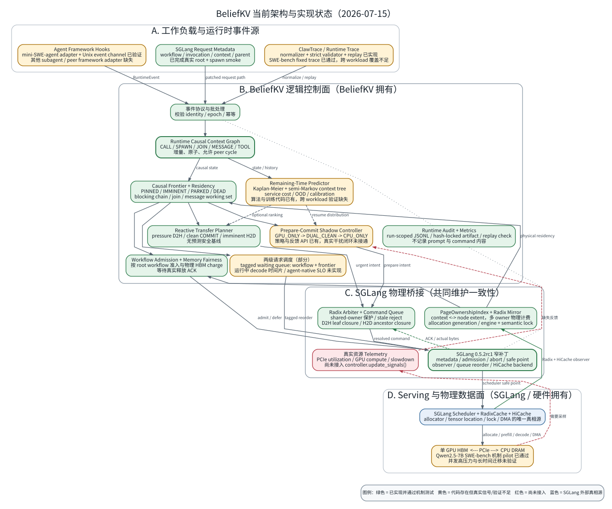
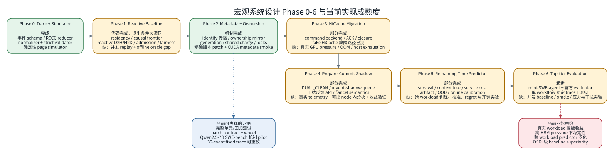

# BeliefKV 架构与实现状态图

更新日期：2026-07-15

本文把此前讨论的宏观系统设计映射到当前仓库。状态判定同时考虑三件事：

- 是否已有实际代码；
- 是否接入 SGLang/agent runtime 的端到端路径；
- 是否有足以支撑系统论文主张的真实负载证据。

因此，“模块代码存在”不自动等于“该设计已经完成”。图中：

- 绿色：代码存在，并通过单元测试、fake backend 或真实机制 smoke；
- 黄色：核心代码存在，但真实信号、真实负载或设计退出条件尚未满足；
- 红色：关键接入、实验框架或实现仍然缺失；
- 蓝色：由 SGLang 或硬件维护的外部真相源。

## 1. 当前端到端架构



可单独打开 [SVG](figures/beliefkv_architecture_status.svg) 或
[PNG](figures/beliefkv_architecture_status.png)。图源位于
[`beliefkv_architecture_status.dot`](figures/beliefkv_architecture_status.dot)。

### 1.1 已经形成的闭环

当前代码已经形成以下控制闭环：

```text
request metadata / RuntimeEvent
  -> identity 与 epoch 校验
  -> Runtime Causal Context Graph
  -> causal frontier / residency / prediction
  -> workflow admission / reactive or shadow intent
  -> Radix arbitration + generation check
  -> SGLang scheduler safe point
  -> HiCache physical action
  -> actual-byte ACK
  -> ownership/residency state commit
```

BeliefKV 只拥有逻辑因果状态、策略和迁移意图。SGLang 仍然是 allocator、
Radix topology、KV tensor、engine lock 和 DMA 状态的唯一真相源。控制器只有在收到
ACK 后才提交物理 residency 转换。

### 1.2 当前不是完整闭环的部分

图中的两条红色虚线代表最关键的运行时缺口：

1. `ShadowController` 已经支持 `pcie_utilization`、`gpu_compute_utilization` 和
   `measured_inference_slowdown`，但 SGLang adapter 尚未采集并更新这些信号；当前
   真实服务中这些值会保持初始值。
2. 通用 `AgentRuntimeAdapter` 可以接收结构化事件，但没有真实 agent framework
   adapter 或跨进程 collector。仅靠 SGLang 请求 metadata 可以恢复 root、call、
   spawn 等请求关系，不能自动捕获所有 tool、join、message 和 return 事件。

## 2. 宏观设计 Phase 对照



可单独打开 [SVG](figures/beliefkv_phase_status.svg) 或
[PNG](figures/beliefkv_phase_status.png)。图源位于
[`beliefkv_phase_status.dot`](figures/beliefkv_phase_status.dot)。

| Phase | 当前状态 | 已实现 | 尚缺少的退出条件 |
|---|---|---|---|
| 0 Trace + Simulator | 完成 | RCCG event schema、ClawTrace normalizer、严格 trace validator、确定性 page simulator | 扩展真实 trace 覆盖属于后续数据工作 |
| 1 Reactive Baseline | 部分完成 | residency、causal frontier、reactive D2H/H2D、workflow admission/fairness、单 workflow 真实 replay | 并发 workload replay、offline oracle gap、端到端收益 |
| 2 Metadata + Ownership | 机制完成 | metadata 传播、Radix mirror、generation、shared charge、lock、精确版本 patch | 更复杂 active/shared 场景的长时间 GPU 压力验证 |
| 3 HiCache Migration | 部分完成 | scheduler backend、ACK、abort/reset、D2H/H2D closure、fake HiCache 故障测试 | 真实 HBM pressure、OOM、host exhaustion、location consistency 压力测试 |
| 4 Prepare-Commit | 部分完成 | `DUAL_CLEAN`、urgent/shadow queue、cancel 语义、feedback API | 真实 telemetry、HiCache node 内可控小分块、PCIe/推理干扰和 useful-shadow 收益 |
| 5 Predictor | 部分完成 | hierarchical survival、semi-Markov context tree、service cost、artifact、OOD、online calibration | 跨 workload 训练与校准、预测开销、decision regret、相对 median/EWMA 的收益 |
| 6 完整实验 | 起步 | 模拟 matrix、Qwen2.5-0.5B smoke、Qwen2.5-7B mini-SWE-agent pilot、官方 SWE-bench evaluator 与固定 trace | 并发 load generator、baseline、offline oracle、长时间压力、故障与干扰实验 |

## 3. 对照宏观模块的代码落点

| 宏观模块 | 当前代码 | 判断 |
|---|---|---|
| Runtime identity 与事件协议 | `core/events.py`、`core/ids.py`、`runtime/agent_runtime_adapter.py`、`runtime/event_channel.py` | 协议和可靠跨进程投递完成；mini-SWE-agent adapter 已验证，其他 framework 待接入 |
| Runtime Causal Context Graph | `control/causal_graph.py` | 已实现 CALL/SPAWN/JOIN/MESSAGE/HANDOFF/TOOL/LLM、原子批处理和幂等 |
| Causal frontier 与 residency | `policy/causal_frontier.py`、`policy/residency.py` | 已实现并有状态转换测试 |
| Workflow admission 与公平 | `policy/admission.py`、`policy/workflow_fairness.py` | admission 和 tagged waiting queue 已接入；运行中 decode 时间片未接入 |
| Remaining-time predictor | `predictor/`、`predictor/training.py` | 算法、artifact 和在线校准已实现；真实泛化实验缺失 |
| Reactive/Shadow 迁移 | `policy/transfer_planner.py`、`policy/shadow_controller.py` | 策略完成；真实资源反馈与收益验证不完整 |
| Ownership 与 Radix arbitration | `runtime/page_index.py`、`runtime/radix_arbiter.py` | generation/shared-owner/closure 已实现；实际执行粒度仍受 HiCache node extent 限制 |
| SGLang 集成 | `runtime/sglang_v052rc1.py`、`runtime/sglang_adapter.py`、`patches/` | 固定版本集成和 metadata smoke 完成 |
| 实验与审计 | `simulator/`、`experiments/`、`metrics/`、`runtime/audit.py`、`traces/runtime_validation.py` | 模拟实验完整；SWE-bench 单实例 harness、官方 evaluator、冻结与重放验证已完成，并发实验尚缺 |

## 4. 已实现内容的准确边界

### 4.1 可以认为已经实现

- 动态 RCCG，不依赖用户提前提供完整 DAG；
- root workflow 粒度的 admission 和 memory/service fairness；
- subagent continuation、join 和 peer message 的统一状态表达；
- context 到 Radix node extent 的多对多 ownership 与共享物理计费；
- stale generation、engine lock、semantic pin 和 active shared owner 保护；
- reactive offload/prefetch 与 Prepare-Commit 状态机；
- urgent/shadow 命令队列、实际 ACK 后提交和 cache reset 失效；
- predictor 训练、加载、OOD fallback 与在线 calibration；
- SGLang 0.5.2rc1 metadata、admission、queue reorder、observer 和 HiCache backend；
- 确定性模拟器、ablation matrix、实验 artifact 和 runtime audit；
- Unix datagram RuntimeEvent 通道、mini-SWE-agent 工具边界采集、SWE-bench
  evaluator、hash-locked trace 冻结和控制平面重放校验。

### 4.2 只能认为部分实现

- **动态 workflow 感知**：图状态可以动态更新，但仍需要 request metadata 或
  runtime hook；尚不能无侵入地自动识别任意 subagent runtime。
- **agent-native 调度**：实现了 admission 和 waiting queue 重排，但未对运行中
  decode batch 做 workflow 时间片、抢占或因果进度调度。
- **CPU shadow**：选择、状态机和取消语义已有，但真实 PCIe/GPU slowdown feedback
  没有接入，HiCache 单个大 node extent 也不能被 BeliefKV 任意切成小 DMA chunk。
- **真实迁移验证**：Qwen2.5-7B SWE-bench pilot 验证了八轮 LLM/tool、metadata、
  audit 和事件生命周期，但单 workflow 没有制造足够 HBM pressure 来验证真实
  D2H/COMMIT/H2D 闭环。
- **预测器**：模型结构和训练流程已实现，但当前 smoke 数据不能证明跨 workload
  泛化，也不能证明预测器相对简单 heuristic 有系统收益。

### 4.3 尚未实现

- 第二个真实 agent framework adapter 和跨进程 RuntimeEvent collector；
- 无显式 metadata 情况下可靠的 subagent/tool/join/message 自动捕获；
- 面向 agent 的运行中 prefill/decode 时间片调度和 TPOT 假设替代方案；
- NVIDIA Green Context 或其他 SM partition 集成；
- 真实 PCIe、GPU compute、copy-engine 和 inference slowdown telemetry；
- 可重复的并发 coding/browser/research/multi-agent load generator；
- SGLang/HiCache/KVFlow/TokenCake/Agentix 风格 apples-to-apples baseline harness；
- offline full-future oracle；
- OOM、host exhaustion、abort/reset、长时间混合压力和故障注入矩阵；
- 在真实 workload 上证明 BeliefKV 的性能、泛化和创新性主张。

## 5. 后续实施优先级

建议按以下顺序推进，而不是继续扩展策略公式：

1. **先完成测量闭环**：接入 PCIe/copy-engine/GPU utilization、allocator 和 slowdown
   telemetry，构建真实 SGLang load generator。
2. **再验证物理迁移闭环**：主动制造 HBM pressure，验证 D2H、DUAL_CLEAN COMMIT、
   H2D、ACK 字节和 location consistency。
3. **扩展真实 agent runtime**：在已有 mini-SWE-agent adapter 之外，至少覆盖一个
   subagent-heavy framework 和一个 peer multi-agent framework，形成可复现 trace。
4. **实现 oracle 与 baseline**：先量化 reactive-oracle gap 和 useful-shadow oracle
   上界，再决定 predictor 是否值得作为核心贡献。
5. **最后做 predictor 泛化与完整性能实验**：按 workload/project/time 分组，报告
   calibration、regret、CPU overhead 和端到端 workflow latency。

当前最需要补的不是更多 policy 分支，而是“真实事件、真实资源信号、真实迁移和
真实 baseline”四类证据。它们决定现有架构能否从完整研究原型升级为顶会系统。

## 6. 重新渲染

修改 `.dot` 图源后执行：

```bash
./scripts/render_architecture_diagrams.sh
```

脚本需要 Graphviz `dot`，并同时生成可缩放的 SVG 和便于预览的 PNG。
