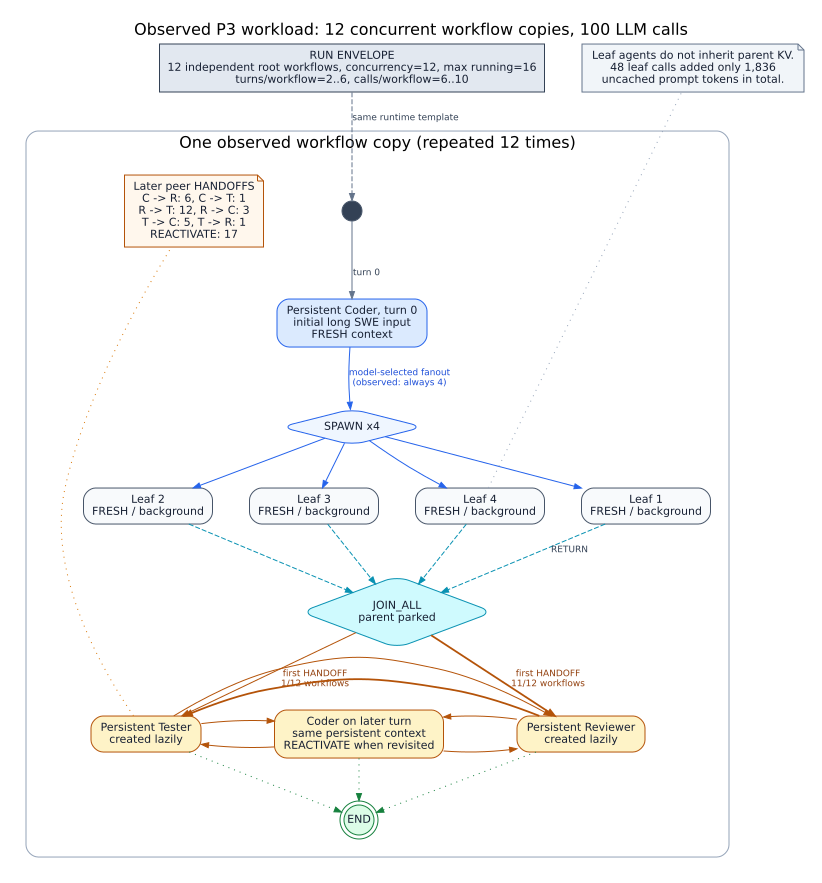

# BeliefKV P3 动态并发 GPU Characterization

日期：2026-07-21

状态：12-workflow mixed workload 正常完成；显式 BeliefKV bundle correctness gate 通过；
全系统 HiCache transfer coverage、queue/service 外部有效性和 P3 oracle gate 未通过

> 归档说明（2026-07-22）：该 workload 的 leaf 为 one-shot 且没有真实工具调用，只能作为
> correctness/topology/pressure 证据。数据已移至
> `experiments/archive/20260722/p3_correctness_only/`，不得进入性能表。

## 1. 实验目的与边界

本轮不比较 BeliefKV 与 baseline 的性能，也不声称 SWE-bench correctness。目标是验证：

1. 真实模型是否能运行 `SPAWN -> JOIN_WAIT -> child RETURN -> HANDOFF -> REACTIVATE`；
2. parked parent 的私有 physical suffix 是否能在高压下完成非零 D2H/H2D；
3. P1.5/P2 的 retry、bundle、allocator 和 callback 不变量在动态 mixed workload 下是否成立；
4. 收集长上下文并发 GPU service、HBM/Host 和迁移时间线，为 P3 rolling model 对齐提供数据；
5. 查找独立 agent scheduling 与 KV control 之间的真实冲突，而不是先假设 JointPlan 有收益。

输入来自 `princeton-nlp/SWE-bench_Verified` 的 12 个 SymPy 实例。manifest 只使用 benchmark
提供的 changed-file 路径做系统 characterization，并读取 pre-fix base commit 的源码；没有把
gold patch 放入 prompt，也没有运行 SWE-bench harness。因此结果只代表动态拓扑与 KV 行为。

## 2. 配置

| 项目 | 配置 |
|---|---|
| 模型 | `Qwen3-Coder-30B-A3B-Instruct-FP8` |
| Runtime | LangGraph peer workflow，内嵌 FRESH subagent |
| SGLang | `0.5.2rc1`，commit `18f91eb639084825717c0e3c3c7273492812ab71` |
| GPU | 单张 RTX 6000 Ada，TP=1 |
| 上下文窗口 | 262,144 tokens |
| KV pool | 163,840 tokens / 16,106,127,360 bytes |
| `mem_fraction_static` | 0.952 |
| HiCache | ratio 2，`write_back` |
| 并发 | 12 workflows，`max_running_requests=16` |
| workload mode | 全部 `mixed` |
| fanout policy | 模型结构化输出选择 1--4；本轮 12 个 parent 均选择 4 |
| BeliefKV | prediction/shadow 关闭，reactive offload/prefetch 开启 |

`mixed` 不是固定 parent-child 脚本。每个 coder 首先自主选择 subagent 数量并等待 join；join
完成后进入 Coder/Reviewer/Tester peer handoff，后续可能再次 reactivation。因而本轮同时覆盖
嵌套 subagent 和对等 multi-agent。child context mode 均为 `FRESH`，不会继承 parent KV。

## 3. 完成性与动态拓扑



该图按本轮 orchestration trace 汇总：12 个 workflow 是互相独立的并发副本；每个副本实际
创建 4 个 FRESH leaf 并执行 JOIN_ALL，随后进入持久 Coder/Reviewer/Tester 的动态 handoff。
负载量与 fairness 的专项审计见
[`beliefkv_p3_workload_fairness_audit_2026-07-22_zh.md`](beliefkv_p3_workload_fairness_audit_2026-07-22_zh.md)。

| 指标 | 结果 |
|---|---:|
| workflow semantic completion | 12 / 12 |
| model request | 100 |
| model error / structured retry | 0 / 0 |
| JCT mean / P50 / P95 | 906.12 / 930.50 / 983.75 s |
| RuntimeEvent | 648 |
| invocation / context | 83 / 83 |
| SPAWN / JOIN_CREATE | 48 / 12 |
| HANDOFF / REACTIVATE | 40 / 17 |
| cycle edge | 20 |
| max spawn fanout | 4 |
| topology entropy | 5.482 bits |
| structured-action coverage | 100 / 100 |
| incremental boundary-token coverage | 0 / 100 |

fanout 虽由模型选择，但 12 次全部落在上限 4，不能据此声称覆盖了 fanout 分布。trace 为
`semantic_race_sensitive`，冻结 replay 只能给 optimistic bound，真实性能结论仍需重复 A/B。

## 4. HBM、Host 与显式迁移

| 指标 | 结果 |
|---|---:|
| peak HBM | 15,611,854,848 B / 16,106,127,360 B = 96.93% |
| peak Host | 1,982,988,288 B |
| command dispatch / ACK | 74 / 74 |
| physical bundle dispatch | 23，全部 `exclusive_suffix` |
| DMA telemetry | 22 |
| D2H | 14 次，1,982,988,288 B |
| H2D | 8 次，532,119,552 B |
| partial / rejected / zero-byte DMA | 0 / 0 / 0 |
| expected / actual reclaim | 2,182,643,712 / 2,182,643,712 B |
| identical failed / zero-byte retry | 0 / 0 |

显式命令层满足 ACK ordering、timestamp、byte bound、allocator/Host mirror 和 reclaim
realization 不变量。P1.5 的 retry storm 没有复现，P2 的 context-to-physical bundle 编译在本轮
实际提交的 23 个 bundle 上没有 partial。

但 blocked preview 仍很常见：1,093 次 preview 被阻塞，其中 `engine_busy=1080`、
`node_locked=981`、`device_capacity=13`；locked GPU snapshot ratio 为 30.22%。这些计数证明
物理约束频繁出现，不证明它们单独主导 JCT。

admission wait P50/P95/P99 为 1.67/24.24/111.00 s，最大 115.20 s。没有配对 baseline，不能
把这些等待归因于或记为 BeliefKV 收益。

## 5. Parent 生命周期

12 个 JOIN_WAIT parent 都发生了显式 D2H，其中 6 个在 `JOIN_WAIT -> JOIN_SATISFIED` 窗口内
开始迁移。每个 parent 的实际 D2H 是一个或多个私有 suffix extent，而不是整个逻辑 context；
聚合大小从 24.5 MB 到 341.6 MB。

7 个 parent context 后续被同一 peer loop 再次使用。显式 H2D 的四个有效 parent 都在对应
LLM request 提交前完成恢复；其中 `peer-context:531253...` 真实触发了
`request_admission_waiting_h2d -> request_admission_h2d_dependency_satisfied`，说明 ACK barrier
链路至少执行过一次。

### 5.1 Join 后错误恢复

`peer-context:93effd...` 暴露了 runtime event 与 KV action 之间的真实资源反转：

```text
JOIN_SATISFIED 使 coder 暂时成为 READY
  -> source runtime 随后发出 coder HANDOFF reviewer
  -> server snapshot 尚未应用 HANDOFF，仍按 transient READY 发起 PREFETCH
  -> H2D 199,655,424 B
  -> HANDOFF 应用后变为 WAIT_MESSAGE
  -> H2D 完成 9.29 ms 后 COMMIT_CPU，立即丢弃刚恢复的 GPU copy
  -> 该 coder context 此后没有任何 LLM request
```

这 199,655,424 B 占本轮显式 H2D 的 37.52%。它不是预测误差：prediction 已关闭。源 trace
中的 HANDOFF 时间比 PREFETCH dispatch 早 8.99 ms，但 dispatch 前最近的 server policy
snapshot 仍把 coder 标为 `READY`；约 0.77 s 后的 snapshot 才反映 `WAIT_MESSAGE`。因此根因
是 JOIN_SATISFIED 与 HANDOFF 分开交付时，controller tick 落入 transient READY 窗口。

该反例不能只靠“统一 observed-state JointPlan”解决，因为 planner 在当时看到的 observed state
本身就是 READY。所需机制至少包括 event batch/transaction、READY 稳定窗口、graph-version
settling barrier，或只允许可撤销 shadow、延迟 irreversible H2D。单个案例仍不能证明端到端
性能收益。

## 6. 新发现：原生 demand-load 未进入 telemetry

三个已 D2H 的 parent 在没有任何 BeliefKV H2D command/telemetry 的情况下再次运行，并得到
9,901、11,594 和 12,426 token 的 cache hit。以 `peer-context:920760...` 为例，reactivation 前
snapshot 明确包含 233,275,392 B 和 26,935,296 B 的 CPU-only suffix；request admission 后旧
CPU extent 被替换为新的 GPU topology。

固定 SGLang 的正常 admission 路径会执行：

```text
Req.init_next_round_input()
  -> host_hit_length > 0
  -> SchedulePolicy.add_one_req()
  -> tree_cache.init_load_back()
  -> cache_controller.load()
  -> scheduler.ready_to_load_host_cache()
```

该 native demand-load 没有 BeliefKV command ID，因此现有 `transfer_telemetry.jsonl` 只覆盖
BeliefKV 显式 DMA，而不是所有 HiCache DMA。由此得到严格结论：

- 22 条 telemetry 的 command integrity 通过；
- 当前 HTML 中 H2D 和 PCIe 使用量只是下界；
- `host_residency_matches_page_index=true` 只证明快照账本一致，不能证明 transfer coverage；
- 在补齐 native write/load start/complete callback 前，P1 的“全量真实 telemetry”与 P2 的
  “全系统 callback 完整性”必须重新标为未闭合。

## 7. GPU service 样本与 rolling gate

本轮新增 observer 采到 1,138 个 runtime GPU batch：decode 1,000、prefill 138，decode batch
覆盖 1--16，最长 sequence 12,615 tokens。这证明旧 microbenchmark 只覆盖 batch 1/2/4 和短
context，不能外推到正式 workload。

当前 `gpu_service_interval_v1` 在 overlap scheduler 中按相邻 completion 切分时间。样本的
per-batch rate 方差很大且随 batch size 非单调，例如 decode batch 12 的聚合吞吐约
9.85 token/s、batch 16 约 9.32 token/s，但某些短 completion interval 会产生异常高瞬时 rate。
因此这些样本适合 characterization，不应直接训练当前 `QueueServiceModel`。下一版应按 GPU
busy interval/overlap episode 聚合，或接入 CUDA/event 层的真实 batch service boundary。

PCIe service-curve holdout 同样未通过：5 个 holdout 中 1 个低估，point estimate 为 20%，
Wilson 95% 区间为 3.62%--62.45%。样本太少，且仍使用 static fallback。

因此本轮没有用旧 service model 重跑 O0--O3；旧 rolling 结果与真实 JCT/transfer 不对齐，
继续输出反事实性能数字会制造伪精度。

## 8. P3 Gate 结论

本轮通过：

- 动态 mixed workflow 正常 completion；
- FRESH child、join、peer handoff、cycle reactivation 可重建；
- 高压下 parent private suffix 发生真实非零 D2H/H2D；
- 显式 bundle 无 partial/reject/retry storm；
- stable prompt 后续可获得 6.9K--12.5K 级 prefix hit；
- 找到一例可审计的 transient-READY race，浪费 37.52% 显式 H2D。

P3 仍未通过退出 gate：

- native HiCache DMA coverage 不完整；
- GPU service/PCIe model 未通过外部有效性 gate；
- incremental action boundary coverage 为 0；
- fanout 没有变化，trace 仍为 semantic-race-sensitive；
- 没有同 manifest 的 baseline A/B、重复实验和置信区间；
- fair multi-workflow rolling oracle 尚未与真实 physical/service trace 对齐；
- 尚无正的 joint synergy gap，也未证明 O3 优于 best(B0--B4)。

下一步不是直接启用 P4，而是先补齐 native HiCache operation telemetry，并把复合 runtime
transition 的交付语义纳入 snapshot/version contract，再用该 trace 校准 rolling model。只有
oracle 在完整物理 accounting 和真实 event-visibility 边界下仍能稳定避免上述 inversion，
JointPlan 才能从工程统一接口升级为算法贡献。

## 9. 产物与验证

原始目录：

- `experiments/archive/20260722/p3_correctness_only/raw/p3_dynamic/20260721T155058Z/server/`；
- `experiments/archive/20260722/p3_correctness_only/raw/p3_dynamic/20260721T155058Z/workloads-all-mixed-c12/`。

处理后产物：

- `experiments/archive/20260722/p3_correctness_only/processed/p3_dynamic_20260721T155058Z/transfer_validation.json`；
- `experiments/archive/20260722/p3_correctness_only/processed/p3_dynamic_20260721T155058Z/kv_transfer_timeline.html`；
- `experiments/archive/20260722/p3_correctness_only/processed/p3_dynamic_20260721T155058Z/parent_transfer_characterization.json`；
- `experiments/archive/20260722/p3_correctness_only/processed/p3_dynamic_20260721T155058Z/gpu_service_characterization.json`；
- `experiments/archive/20260722/p3_correctness_only/processed/p3_dynamic_20260721T155058Z/dynamic_trace_characterization.json`；
- `experiments/archive/20260722/p3_correctness_only/processed/p3_dynamic_20260721T155058Z/multi_workflow_counterfactual_workload.json`。

冻结 trace 含 100 个 request、12 个 workflow、133 条 dependency edge、116 条 semantic edge，
token identity 和 request physical delta coverage 均为 100%，初始 Radix epoch 已知为空；但
`future_physical_growth_exact=false`，不能跳过 rolling 重算。

```text
conda run -n beliefkv pytest -q
310 passed, 6 skipped

conda run -n beliefkv-agents pytest -q tests/test_multi_agent_runtime.py
14 passed

SGLang source contract: compatible=true
```

实验结束后 compute-app 列表为空，没有遗留 SGLang/GPU 进程。
